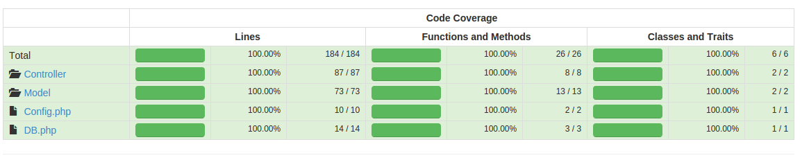

# SimpleRoles - Testing 
## How to test this application

## Unit Tests

Unit tests are triggered through ant (so ensure you have ant installed).  In order to test the application you also need to ensure you have 
the necessary dependencies installed as well.  In this application this is done via composer.  So, simply running the following two commands from the base directory of the application will run through the unit tests:

```
composer install;
ant -f tests/build.xml phpunit
```

You should end the tests with a line such as:

```
[exec] OK (30 tests, 97 assertions)
```

Over time the number of tests and assertions might change, but hopefully the result should not, if it does, there is a problem!

You will also notice while running these tests you will see some other steps happening during the setup.  
These steps include cleaning out the database by reloading the base schema and then adding in seeded data which is used to test with.  You can view the database seed in the Seeds directory in the tests folder.  I choose this route as I think mocking out the database is an exercise 
in futility.  

There are other steps which are usually run during this phase including the static code analysis which checks complexity, and coding style adherence.  You can run these easily enough with this:

```
composer install;
ant -f tests/build.xml
```

outside of a Jenkins Environment you can view the results of this within the build directory.

### Code Coverage



## Functional Tests

The functional tests use Behat to test the various web service entry points.  It does not seed the database, but rather reloads the schema
and every scenario will add in the necessary data in order to test the API entry point.

To run locally, you should edit the build file in test/build.xml  Specifcially this section which defines the defaults for your local environment:

```
    <target name="behat_config_local" description="configure for behat" depends="behat-run-config">
        <replace file="${basedir}/tests/SimpleRoles/Functional/behat-run.yml" token="[web_host]" value="http://127.0.0.1"/>
        <replace file="${basedir}/tests/SimpleRoles/Functional/behat-run.yml" token="[web_port]" value="80"/>
        <replace file="${basedir}/tests/SimpleRoles/Functional/behat-run.yml" token="[web_path]" value="sr"/>
        <replace file="${basedir}/tests/SimpleRoles/Functional/behat-run.yml" token="[db_host]" value="localhost"/>
        <replace file="${basedir}/tests/SimpleRoles/Functional/behat-run.yml" token="[db_port]" value="3306"/>
        <replace file="${basedir}/tests/SimpleRoles/Functional/behat-run.yml" token="[db_name]" value="simpleRoles"/>
    </target>
```

Once you have these updated to your local environment you can easily run the tests from the root directory by running these commands:

```
composer install
ant -f tests/build.xml behat-local
```

The result should provide output like:

```
     [exec] 7 scenarios (7 passed)
     [exec] 45 steps (45 passed)
     [exec] 0m0.62s
```

Additionally result files will be copied to the build directory.  Specifically the directory: build/behat which will have the junit formatted results and the file: build/logs/behat_report.html which will have the output nicely formatted in HTML.